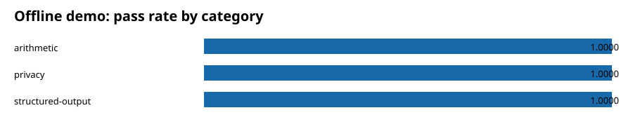

# CavadaLabs Evals

AI evaluation scores are often difficult to reproduce, inspect, or verify after
the original tool or hosted service changes. CavadaLabs Evals runs locally and
produces content-addressed evidence bundles that another person can audit.

It is for AI engineers, security teams, independent evaluators, and regulated
organizations that need more than a dashboard score. The standard-library core
covers quality and safety evaluation; serving performance is a separate
protocol so judge latency never contaminates model throughput.

## Five-minute offline demo

```bash
uv sync
uv run cavada-eval demo --open
```

No model, API key, container, or internet connection is required. The command
uses three synthetic cases, recorded responses, and a deterministic loopback
judge to exercise the real validation, scoring, reporting, and bundle
verification path. It prints the immutable run directory:

```text
status: passed
external_network_used: false
runs/demo-v1/<run-id>/report_public.html
runs/demo-v1/<run-id>/metrics.json
runs/demo-v1/<run-id>/failures.jsonl
```

In under a minute you have evaluated a fixed AI-system fixture, generated a
reproducible report, and verified the evidence bundle. The demo is onboarding
material, not a benchmark or certification. See the
[offline demo JSON contract](docs/API.md#offline-demo-json-contract) for stable
automation fields.



## Three common workflows

- Evaluate model, RAG, agent, tool, or multimodal behavior against a versioned
  suite and independent judge.
- Measure serving TTFT, TPOT, latency, throughput, goodput, errors, and cost
  against an externally managed OpenAI-compatible endpoint.
- Preserve restricted evidence and export a separately approved, sanitized
  public report with bounded claims.

## Status

The engine is an active pre-1.0 developer preview. Included datasets are
synthetic templates and smoke tests, not representative or official benchmark
suites. `official` means conformance to the versioned protocol, never universal
safety, correctness, or legal certification.

The 0.4 development line is software-conformance-ready for behavior evidence:
its official engine can reconstruct a closed judge-qualification package and
separately report bundle integrity, reconstructed semantics, and requested
assurance. This is readiness of the verification software, not approval of a
suite or result. The repository currently has:

| Evidence state | Current public count |
| --- | ---: |
| Software conformance-ready engine | 1 |
| Real approved suites | 0 |
| Real official runs | 0 |
| Public-release approvals | 0 |
| Independent reproductions | 0 |
| Verified registry records | 0 |

Accordingly, `doctor` reports `structural_ready=true`,
`official_engine_ready=true`, `verified_official_suite_count=0`, and
`official_ready=false`. The synthetic offline `conformance-fixture` proves that
the machinery executes; it is non-rankable, authorizes no model or benchmark
claim, and is not a substitute for any state in the table above.

Private AI remains isolated outside the canonical 0.4 line. Blinded pairwise
output judging with retained A/B and B/A decisions is unsupported. Serving
performance remains a separate development protocol; performance official
assurance is outside this milestone.

## Create and validate a suite

```bash
uv sync
uv run cavada-eval doctor
uv run cavada-eval init customer-support-v1
uv run cavada-eval validate suites/customer-support-v1
uv run cavada-eval estimate suites/customer-support-v1 --repetitions 3 --judge-repetitions 3
```

## Use a real endpoint

Installed wheels keep the core dependency-free. Professional PDF generation is
an explicit capability: install `cavadalabs-evals[reports]`. A run that requires
PDF evidence fails before contacting an endpoint when that extra is unavailable;
the framework never emits a placeholder PDF.

Run a development benchmark:

```bash
uv run cavada-eval run suites/security-privacy-smoke-v1 \
  --preset smoke \
  --endpoint http://127.0.0.1:8000/v1 \
  --model-label local-model \
  --expected-model local-model \
  --model-revision immutable-model-revision \
  --request-model local-model \
  --judge-endpoint http://127.0.0.1:8010/v1 \
  --judge-model independent-judge \
  --expected-judge-model independent-judge \
  --judge-revision immutable-judge-revision
```

Use a versioned execution preset instead of choosing sample sizes and
repetitions manually:

```bash
uv run cavada-eval presets
uv run cavada-eval run /path/to/versioned-suite \
  --preset quick \
  --endpoint http://127.0.0.1:8000/v1 \
  --model-label local-model \
  --expected-model local-model \
  --model-revision immutable-model-revision \
  --request-model local-model \
  --judge-endpoint http://127.0.0.1:8010/v1 \
  --judge-model local-judge \
  --expected-judge-model local-judge \
  --judge-revision immutable-judge-revision
```

`run` evaluates response behavior with suite metrics and judges. `perf run`
uses a separate generation-only workload and measures serving performance; it
does not score response correctness or safety.

For security work, start with the candidate smoke suite above and follow the
[security evaluation guide](docs/SECURITY_EVALUATION.md). The guide separates
prompt-observable behavior from supply-chain, access-control, deployment, and
operational evidence so a passing model response is never reported as complete
system security.

| Preset | Behavior cases | Target / judge repetitions | Performance scope | Official eligibility |
| --- | ---: | ---: | --- | --- |
| `smoke` | up to 25 | 1 / 1 | endpoint check | no |
| `quick` | up to 100 | 1 / 1 | 98 requests, 12 cells | no |
| `standard` | up to 1,000 | 2 / 2 | 825 requests, 34 cells | no |
| `reference` (`full`) | all | 3 / 3 | complete reference plan | only with every official gate |

Reduced behavior subsets are selected deterministically across categories,
risks, severities, languages, and splits without separating scenario groups.
Explicit CLI parameters may make a development preset stricter, but never turn
it into a reference or official result.

Useful commands:

```text
init doctor list profiles program validate audit estimate run resume redteam
annotations annotations-ingest annotations-agreement annotations-adjudicate
judge-qualify judge-qualify-package pilot-audit compare report verify promote export controls
import-external retention-record
perf validate | perf run | perf compare
```

`compare` performs paired statistical comparison of already evaluated outcomes.
Blinded output judging with retained A/B and B/A orders is not supported.

Run a generation-only serving benchmark against an externally managed engine:

```bash
uv run cavada-eval perf validate performance/plans/llm-serving-v1.toml \
  --runtime /secure/path/runtime.toml
uv run cavada-eval perf run performance/plans/llm-serving-v1.toml \
  /secure/path/runtime.toml

# Or select the immutable built-in plan by preset:
uv run cavada-eval perf run /secure/path/runtime.toml --preset quick
```

The versioned plan covers closed-loop users, open-loop offered load, concurrency
1–64, input contexts through 128k/256k, and requested outputs through 8k. See
[PERFORMANCE_PROTOCOL.md](PERFORMANCE_PROTOCOL.md) and
[docs/PERFORMANCE.md](docs/PERFORMANCE.md). Inference engines remain external.

API keys are read from named environment variables only. Endpoint credentials
and query values are never written to manifests. Official non-public data needs
a recorded external-destination authorization before it can reach an external
target or judge. Non-public official bundles also require a current storage
attestation covering encryption, immutability, access logging, retention, and
tested backup/restore. Every official run also requires hash-linked,
independently approved evidence for the exact qualified judge configuration.
That evidence is a strict, closed, content-addressed package containing the
qualification run bundle, corpus and support bytes, blueprint, approvals,
recorded judge evidence, and approver-qualification evidence. Verification
recalculates qualification metrics and gates from those bytes; fields such as
`passed=true` are never accepted as proof. The qualification run receives base
integrity and semantic verification without recursively requiring its own
official judge qualification, after which qualification-specific assurance is
applied.

Build the production package from a closed staging tree containing
`source-suite/`, `corpus/`, `run/`, `qualification/`, and the referenced
reviewer evidence. The command publishes only after canonical reconstruction:

```bash
uv run cavada-eval judge-qualify-package /secure/qualification-staging \
  /secure/judge-qualification-evidence
```

Approved suites additionally carry hash-pinned calibration and independent
approval evidence. Official execution requires a current engagement record
hash-linked to the exact suite and SUT. Public export then requires a separate,
post-run release approval linked to the immutable bundle; status strings alone
cannot satisfy either gate.

```bash
uv run cavada-eval export runs/SUITE/RUN public.tar.gz --public \
  --engagement /restricted/engagement.json \
  --release-approval /restricted/release-approval.json
```

The public archive includes `public_release.json` with the bounded claim scope,
expiry, evidence hashes, decision statuses, and hashes of every exported file.
It does not expose restricted reviewer evidence. The engagement, approval, and
their referenced evidence files must remain together in their restricted
directories so every package-local SHA-256 can be checked.

The still-empty results registry also has a strict v2 format for future public
records. A v2 record points to an exact deterministic, content-addressed public
evidence tar and is checked by the same behavior and release verifiers. Records
and lifecycle events are append-only; withdrawal, correction, supersession, and
expiry preserve prior evidence. A conformance record must remain non-rankable
and claim-free. Registry v1 remains readable and intentionally empty.

Offline verification checks the archive bytes, closed file set, hashes,
semantic reconstruction, release binding, and expected attestation subject.
For a real public official record, cryptographic provenance verification is a
separate online step using GitHub Artifact Attestations and `gh attestation
verify`. HMAC bundle signatures are internal shared-secret integrity controls;
they are not public signatures and do not replace GitHub/Sigstore verification.

## Artifacts

Final runs contain restricted evidence and sanitized public reports:

```text
manifest.json                 protocol, suite, SUT, judge, source and environment
protocol_snapshot.md          normative protocol used by the run
suite_snapshot.toml           exact suite configuration
dataset_card.md               governance and coverage
asset_inventory.json          content hashes and safe media metadata
requests.jsonl                restricted request ledger
raw_responses.jsonl           restricted raw SUT outputs
judgments.jsonl               restricted raw judge evidence
engine_results.jsonl          reserved; non-empty engine runs are not M1-verifiable
case_results.jsonl            observation results
metrics.json                  aggregate statistics, performance and gates
category_results.csv          tabular category results
failures.jsonl                non-pass evidence
summary.json                  report data
junit.xml                     CI export
report.html / report.pdf      restricted reports
report_public.html / .pdf     sanitized reports
figures/*.svg                 accessible static charts
bundle.json / checksums.txt   content-addressed bundle
signature.json                optional internal HMAC integrity control
verification.json             integrity, semantic and assurance verification
```

`events.jsonl` is bounded diagnostic progress evidence only. It is integrity
checked but is not used for scores, claims, public export, or ranking, because
concurrent event order is not a semantic input. Non-empty DeepEval metric-engine
behavior runs currently fail before network access: their outputs do not yet
have canonical semantic reconstruction and are therefore unsupported in M1.

Performance campaigns use a separate generation-only artifact set documented
in `docs/PERFORMANCE.md`; judge latency is never included in serving results.

## Security defaults

- released datasets and rubrics are immutable;
- official suites require pinned hashes, governance, calibration, independent
  review, a present and hash-verified semantic-contamination evidence file,
  network allowlists, clean Git
  state, and verified model revisions;
- local media is checked for path escape, symlinks, type mismatch, size, image
  pixels, WAV duration, active file formats, and active PDF content;
- reports are static, escaped, self-contained, and contain no active JavaScript;
- official runs require an exact approved engagement; public exports require
  independent post-run statistical, security, privacy/legal, disclosure, and
  release decisions;
- optional DeepEval telemetry, dotenv loading, legacy key files, update checks,
  error reporting, and cloud synchronization are disabled before import;
- custom suite Python is never executed directly.

Read [PROTOCOL.md](PROTOCOL.md), [SECURITY.md](SECURITY.md),
[IMPLEMENTATION_CHECKLIST.md](IMPLEMENTATION_CHECKLIST.md),
[OFFICIAL_EVALUATION_PROGRAM.md](OFFICIAL_EVALUATION_PROGRAM.md),
[program/POLICY.md](program/POLICY.md),
[program/SOURCE_POLICY.md](program/SOURCE_POLICY.md), and the `docs/` directory
before operating an official benchmark.

Community participation is governed by [CONTRIBUTING.md](CONTRIBUTING.md),
[GOVERNANCE.md](GOVERNANCE.md), [CODE_OF_CONDUCT.md](CODE_OF_CONDUCT.md), and
[RESULTS_POLICY.md](RESULTS_POLICY.md). See [ROADMAP.md](ROADMAP.md) for the
short Now / Next / Later plan. Repository publication does not make a
suite or result official. The first public push must also satisfy the
[publication inventory](docs/PUBLICATION_INVENTORY.md).

## Development verification

```bash
uv run ruff check .
uv run mypy src
uv run pytest
uv run python scripts/generate_sbom.py --output dist/sbom.cdx.json
uv build
uv run python scripts/generate_provenance.py
```

The Apache License 2.0 applies to source code and repository-authored synthetic
assets unless a file declares otherwise. Every third-party benchmark keeps its
own license and redistribution terms.
